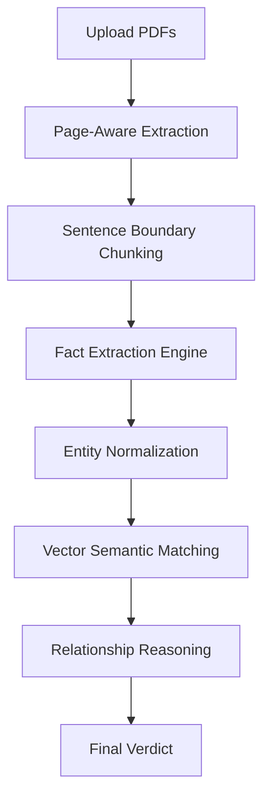

# Knowledge Layer

### Evidence-Grounded Knowledge Layer for Complex PDFs

Knowledge Layer converts multiple PDF documents into a structured, evidence-grounded knowledge graph.

It extracts meaningful factual claims, preserves their source evidence (document, page, and exact quote), normalizes values and context, identifies relationships across documents, and produces an explainable final verdict using deterministic fallback heuristics and optional Anthropic LLM support.

Instead of treating every difference as a contradiction, the engine considers factors such as **time, scope, units, currency, and numerical variance** before classifying relationships.

---

## Overview

The pipeline follows an evidence-first approach:



The result is an inspectable knowledge layer where every important conclusion can be traced back to its source.

---

## Core Capabilities

### 1. Page-Aware PDF Extraction
PDFs are parsed locally using `pdfplumber` while retaining document and page-level provenance.
For every extracted chunk, the engine preserves:
- Document filename
- Page number
- Original source text snippet

### 2. Dynamic Fact Extraction
The engine extracts both numerical and semantic facts using a flexible schema. If an Anthropic API key is provided, it uses Claude 3.5 Sonnet. If not, it falls back to a deterministic Regex/Heuristic engine.

A fact object contains:
```json
{
  "statement": "The company reported a 15% revenue increase",
  "entities": ["company", "revenue"],
  "units": "%",
  "time_scope": "2024",
  "confidence": 0.85,
  "evidence_quote": "...reported a 15% revenue increase in FY24..."
}
```

### 3. Cross-Document Relationship Analysis
The engine uses ChromaDB to find semantically similar facts across different documents. It then compares them to classify their relationship.

#### Primary Classifications:
- **CORROBORATION:** Facts discuss the same topic and numerical values align.
- **CONTRADICTION:** Facts discuss the same topic but contain conflicting numerical values.
- **CONTEXTUAL RECONCILIATION:** Facts discuss the same topic but refer to different timeframes (e.g., 2024 vs 2025).
- **EXTRACTION FAILURE:** Ambiguous context or missing numbers preventing a confident verdict.

---

## Running the Application

This project uses a modern two-tier architecture:
1. **FastAPI Backend:** Handles PDF ingestion, parsing, ChromaDB vector search, and the SQLite relational database.
2. **Streamlit Frontend:** A sleek, dark-mode analytical dashboard with custom CSS.

### Prerequisites
- Python 3.9+
- *(Optional)* Anthropic API Key (Set `ANTHROPIC_API_KEY` in your `.env`)

### Setup Instructions

1. **Clone the repository:**
   ```bash
   git clone https://github.com/Mehtarishita/fact-knowledge-layer.git
   cd fact-knowledge-layer
   ```

2. **Create a virtual environment and install dependencies:**
   ```bash
   python -m venv venv
   source venv/bin/activate  # On Windows: venv\Scripts\activate
   pip install -r requirements.txt
   ```

3. **Start the FastAPI Backend:**
   Open a terminal and run:
   ```bash
   uvicorn app.main:app --reload
   ```
   The backend will start on `http://localhost:8000`.

4. **Start the Streamlit Frontend:**
   Open a *second* terminal (keep the backend running) and run:
   ```bash
   streamlit run frontend/app.py
   ```
   The dashboard will automatically open in your browser at `http://localhost:8501`.

### Clearing the Ledger
If you want to reset the database and vector store for testing new documents, simply click the **"Clear Ledger (Reset)"** button in the Streamlit sidebar Control Panel.

---

## Running Tests

An integration test suite is provided to verify the dynamic reasoning engine.
To run the tests:
```bash
PYTHONPATH="." pytest tests/
```
